# Traveleando 
Traveleando es una plataforma de venta y reserva de pasajes de autobús de diferentes líneas comerciales ofreciendo, como valor agregado, recomendaciones personalizadas según los intereses del usuario. 

## Desarrollado para 
[Laboratoria](http://laboratoria.la)

## UNIDAD 1

## NUEVA EXPERIENCIA EN EMPRESAS DE BUSES
*Nos ha contactado Catalina una emprendedora viajera con una idea de negocio. Durante sus últimas vacaciones Catalina estuvo viajando por todo latinoamérica. Durante estos viajes Catalina tuvo que tomar muchos buses de todo tipo para llegar a ver los paisajes más lindos del continente. Durante sus viajes Catalina se dio cuenta que existen aún muchas oportunidades para mejorar la experiencia de todos los usuarios de este tipo de transporte: horarios, embarques, desembarques, compra de tickets en los terminales, compra de tickets online, cancelaciones, cambios de pasajes, etc. Adicionalmente, Catalina se dio cuenta que todas las plataformas de venta de tickets de bus tienen cosas por mejorar en Chile, Perú y México.*

*Luego de vivir todo esto, Catalina está pensando en emprender en este sector. Para ello ha contratado a tu squad para que la ayude a investigar más sobre los usuarios de este tipo de transportes y para que definan y prueben un MVP.*

*Con tu asesoría, ella podrá sustentar su idea de negocio a un grupo de inversión y así obtener el financiamiento necesario para emprender su negocio y mejorar la experiencia en este rubro.*

### Fases del proceso

### 1. Descubrimiento e Investigación 

## USER RESEARCH CUALITATIVO

Se realizó un **diagrama de Afinidad** con la finalidad de poder analizar las propuestas de preguntas de cada una y no repetirlas durante la entrevista.

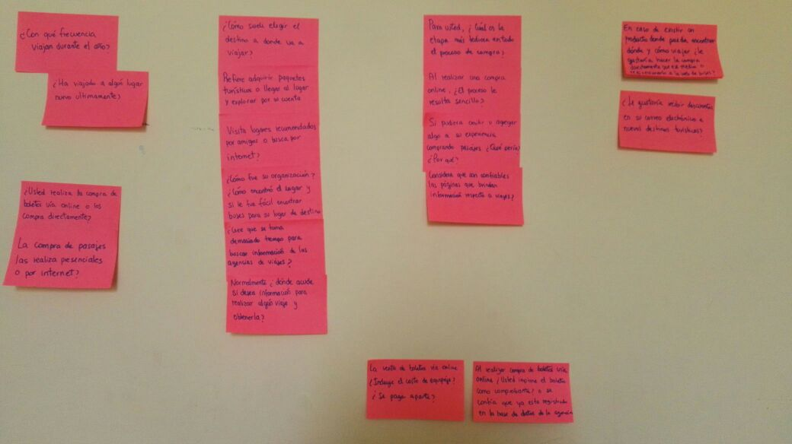

El squad se dividió en dos equipos:

# Equipo A: Terminal Terrestre Plaza Norte

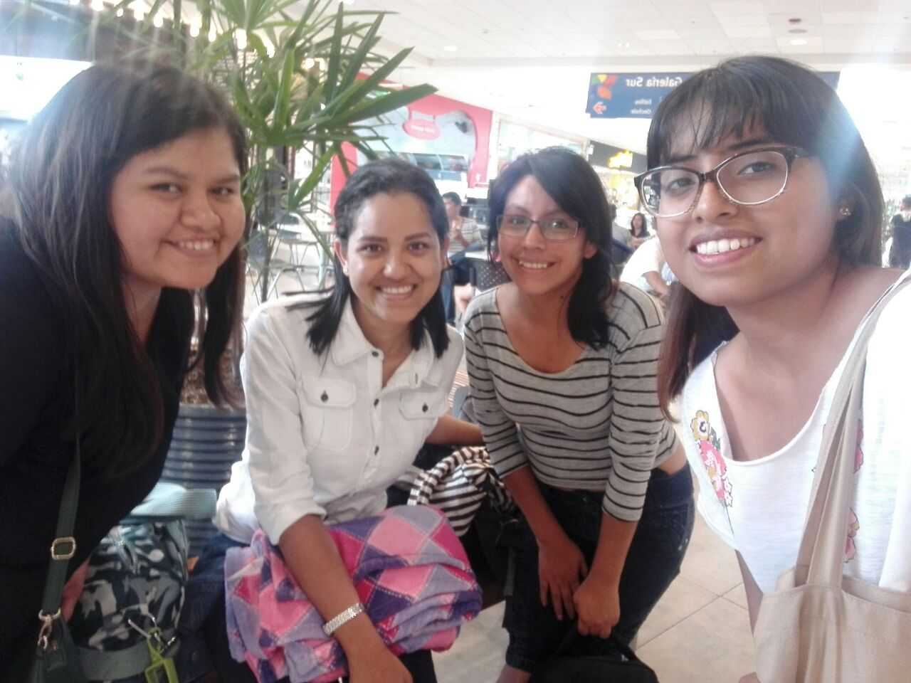

# Equipo B: Terminal Terreste Cruz del Sur y Movil Tours

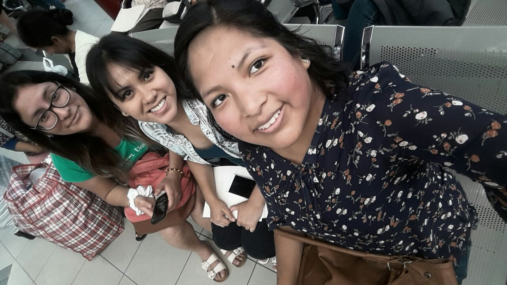

Se realizó una **observación contextual** dentro del terminales de autobuses para conocer como era el comportamiento de los usuarios, se descubrió lo siguiente:

- Los usuarios se sentían fastidiados por la larga cola en la compra.

- Los usuarios que esperaban abordar miraban aburridos en todas las direcciones o caso contrario sus celulares.

- Algunos usuarios parecían nerviosos y estaban muy atentos para tener cuidado en no dejar pasar su autobus.

Posteriormente, el equipo comenzó a realizar las **entrevistas** a personas estaban haciendo fila para la compra de pasajes o esperaban abordar.

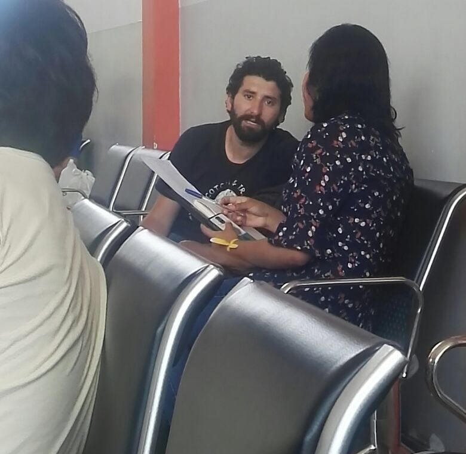

###### Es importante mencionar que en el proceso se obtuvo muchos bloqueantes por parte de la seguridad de los terminales, quienes indicaban que se tenía que pedir permiso a la administración como mínimo de un día antes por lo que en muchos casos interrumpieron abruptamente la entrevista con los usuarios. Sin embargo, aún así el equipo se las ingenio para seguir realizando las entrevistas de una manera más discreta.

Al promediar las 16:00 horas, el equipo se junto en el domicilio de la integrante Stephanie Wong con la finalidad de compartir sus experiencias durante el trabajo de campo, darse feedbacks sobre lo que se hizo bien, pudo haber sido mejor y como cada una hubiera abordado la situación.

Ya con los datos comparados, el equipo procede a contactarse con otros usuarios más cercanos, con la finalidad de tener un espacio más cómodo para una segunda entrevista.

## USER RESEARCH CUANTITATIVO

Se realiza las **encuestas** que serán enviadas a familiares y amigos a través de internet, con la finalidad de darnos una idea de la situación actual.

Para esta fase del proceso se usaron las siguientes herramientas:

- Google form

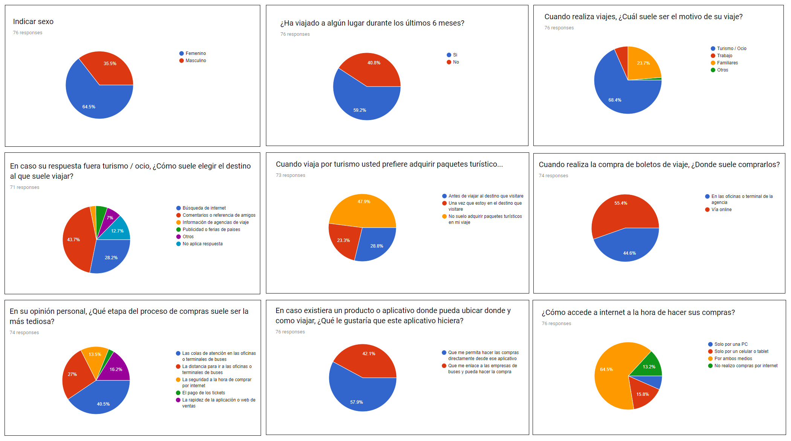

# Análisis Competitivo - Benchmark

Sabemos que el principal problema de nuestro usuario es la información ¿Cómo lo resolvieron otras empresas?. Identificamos a nuestros competidores y evaluamos sus estrategias para determinar sus fortalezas y debilidades en relación con las de nuestra propia solución.

Para esto utilizamos la técnica **Thinking Aloud Testing**

Definición : En una prueba de pensamiento en voz alta, se pide a los participantes que usen el sistema mientras que continuamente piensan en voz alta, es decir, simplemente verbalizan sus pensamientos a medida que se mueven a través de la interfaz de usuario.

- Nuestra participante realizó la prueba en la interfaz de la aplicación **Red Bus**:

[Video](https://drive.google.com/open?id=14ZBSrJp0GwIgVZRArCLxXCkFwnls6Y-N)

# Análisis Comparativo

| ***Web Site*** | Fácil de usar | Recomienda Destinos | Información | Filtrado | Compra Online | Reservar Tickets |
| -- | -- | -- | -- | -- | -- | -- |
| [Red Bus](https://www.redbus.pe/) | ✔ | ✘ | ✘ | ✔  | ✔ | ✘ |
| [Recorrido.cl](https://www.recorrido.cl/es) | ✘  | ✘  | ✘ | ✔  | ✔ | ✘ |
| [Click Bus](https://www.clickbus.com.mx/es/) | ✘ | ✘ | ✔ | ✔ | ✔ | ✘ |

# Indicadores

Se empleó la herramienta **Metricspot** *(https://metricspot.com)* para analizar y tener mayor información de nuestra competencia.

# a. Análisis Web de **https://www.redbus.pe/**

**Análisis Web**

**Datos Históricos**

**Impacto en Redes Sociales**

# b. Análisis Web de **https://www.recorrido.cl/es**

**Análisis Web**

**Datos Históricos**

**Impacto en Redes Sociales**

# c. Análisis Web de **https://www.clickbus.com.mx/es/**

**Análisis Web**

**Datos Históricos**

**Impacto en Redes Sociales**

### 2. Síntesis y Definición 

## AFFINITY MAPING

Durante las horas de clases, y con la orientación de nuestros profesores Gonzalo Loayza y Gabriela Segura, se comenzó a trabajar para realizar el ejercicio de **findings en post it** para posteriormente realizar el **Affinity Mapping** donde se agruparon los problemas según su categoría.

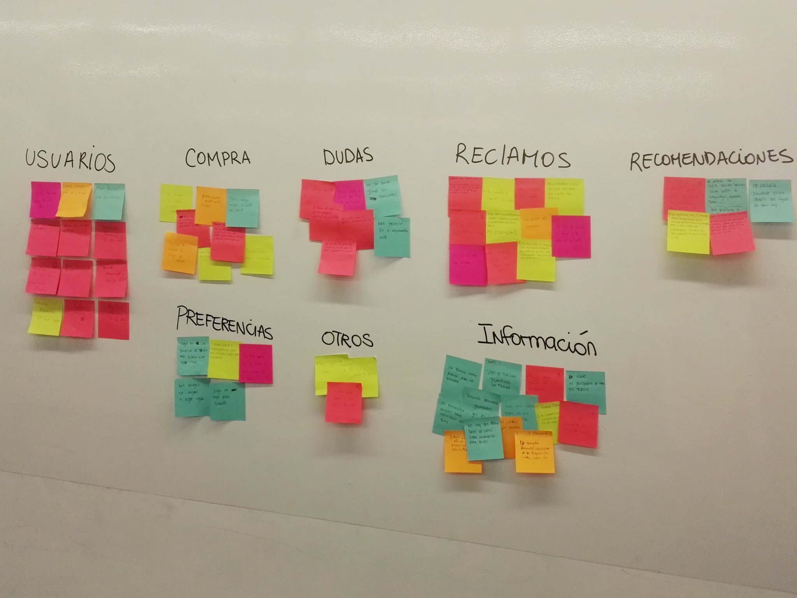

Se agruparon todas las observaciones de los usuarios en las siguientes categorías :

- Compras
- Dudas
- Información
- Preferencias
- Reclamos
- Recomendaciones
- otros

Luego de analizar todo la información obtenida, nos dimos cuenta de que de las categorías **Información** y **Reclamos** tienen más coincidencia entre nuestros usuarios, por ellos decidimos abordar estas categorías para la obtención de nuestra problemática.

## Problemática sobre la información

- "He buscado en muchas páginas de internet, pero no encuentro información sobre qué buses debo tomar..."
- "No encuentro información actualizada"
- "Pierdo mucho tiempo buscando información de los lugares"
- "Pido recomendaciones a mis amigos y familiares sobre buses y lugar a los que voy"
- "Realizo mis búsquedas en foros"

Estos son algunos comentarios que hicieron los usuarios en las entrevistas.

También encontramos esta problemática en algunos foro de internet

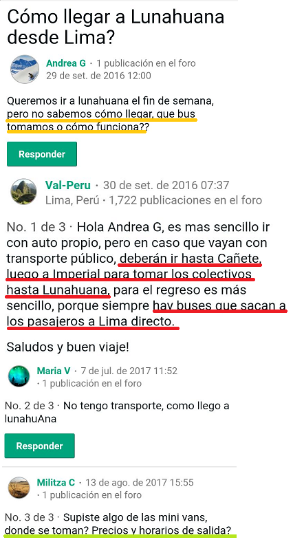

## USER PERSONA

Con la información recaudada de las entrevistas, se define nuestro User Persona.

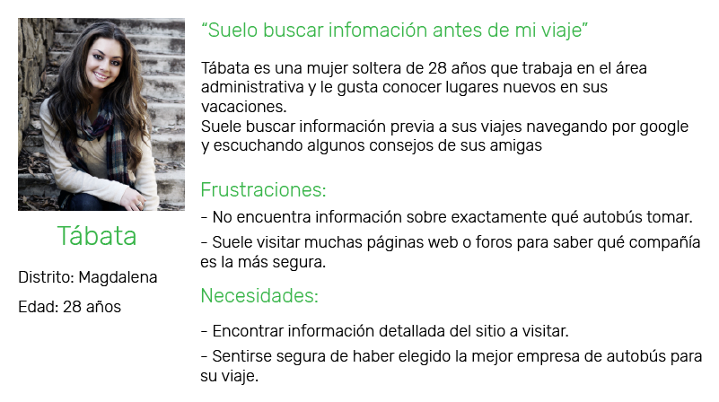

## PROBLEM STATEMENT

Usamos el siguiente patrón para definir un problema:

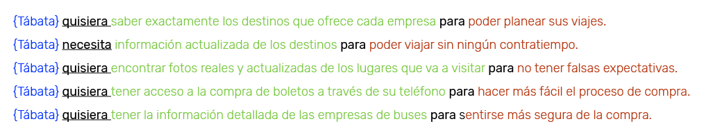

## HMW (HOW MIGHT WE?)

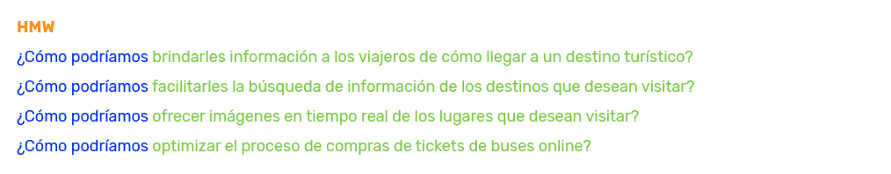

## WHAT IF?

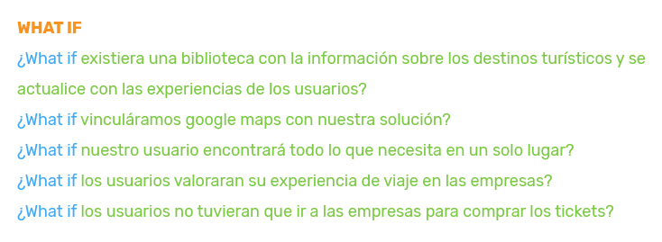

### 3. Conceptualización e ideación

## FEATURE LIST

# Priorización

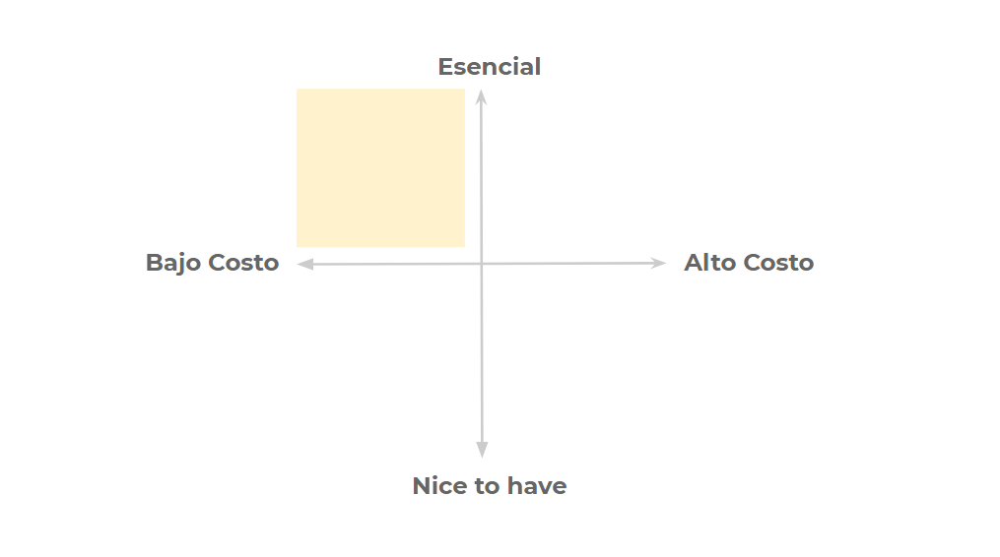

Luego de observar la información recogida y analizados nuestros Problem Statements, se prioriza lo descubierto (**falta de información**)

## MVP

Nuestro producto mínimo viable debe contener lo siguiente:

- Que pueda seleccionar un lugar para viajar según sus preferencias.
- Que pueda realizar la compra tanto en la página como en la web de la empresa de buses.
- Que tenga opciones de filtros según precios, valoraciones y servicios.
- Que pueda loguearse con facebook, google y correo.

Este mínimo producto viable se realizó debido a que representa lo esencial y es de bajo costo realizarlo.

## STORYBOARD

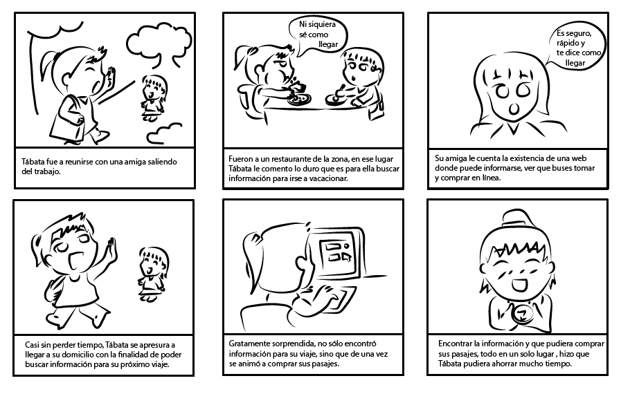

### 4. Prototipado

## CONTENT PROTOTYPE

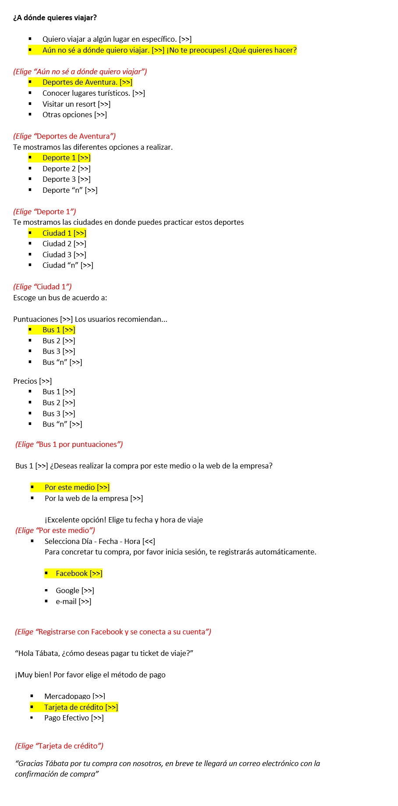

## PROTOTYPE 

Con nuestro MVP definido, se procede a realizar el prototipo.

**Vista responsive en celular**

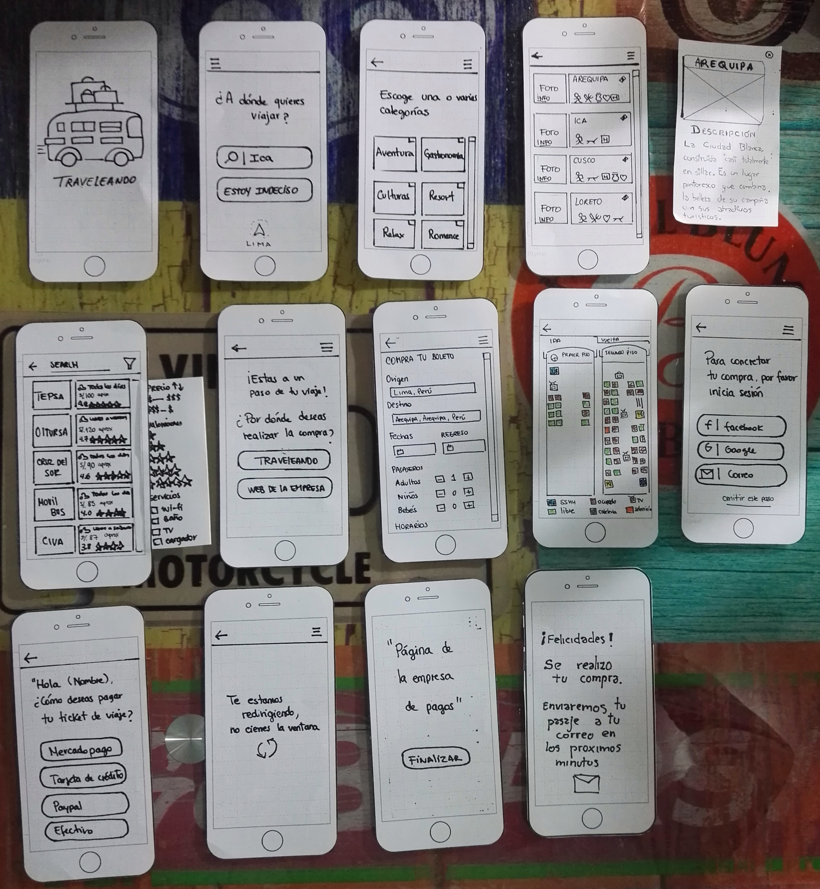

### 5. TESTING

Se realizaron diferentes testing con el objetivo de mejorar el proceso.

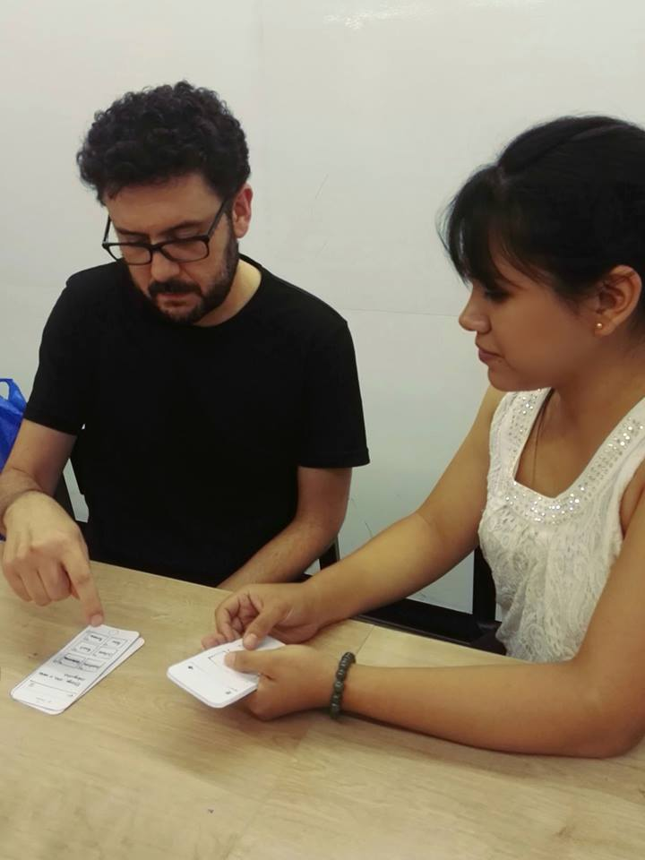
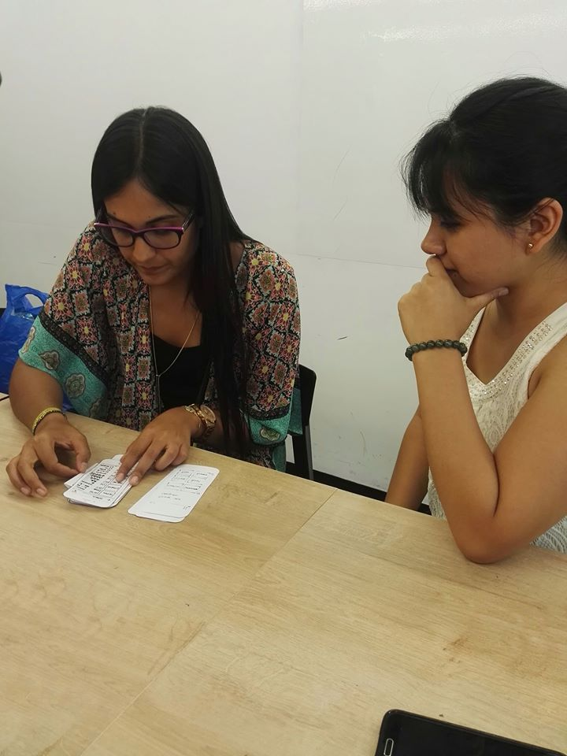
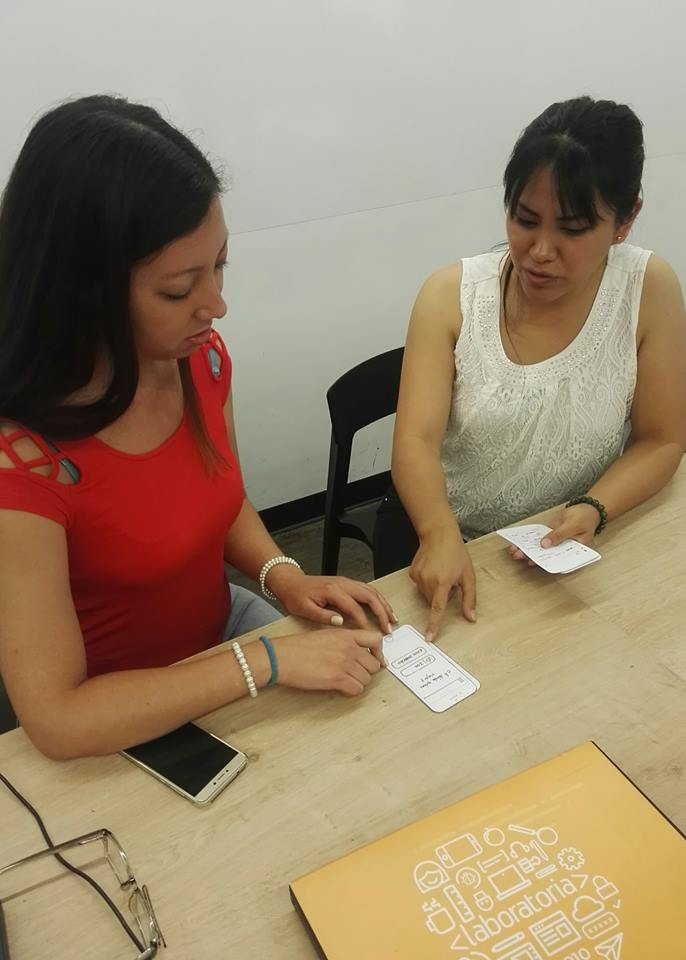
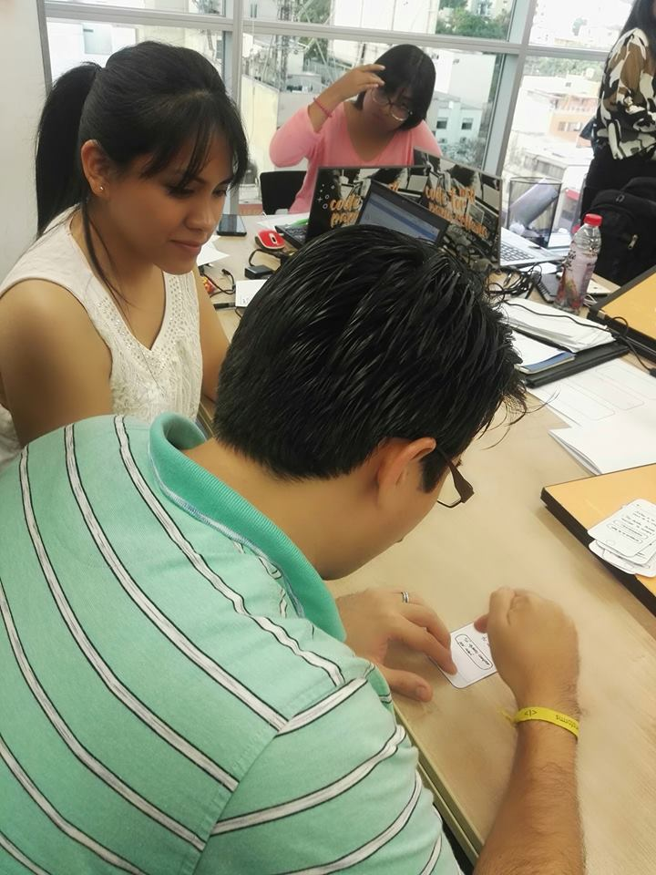
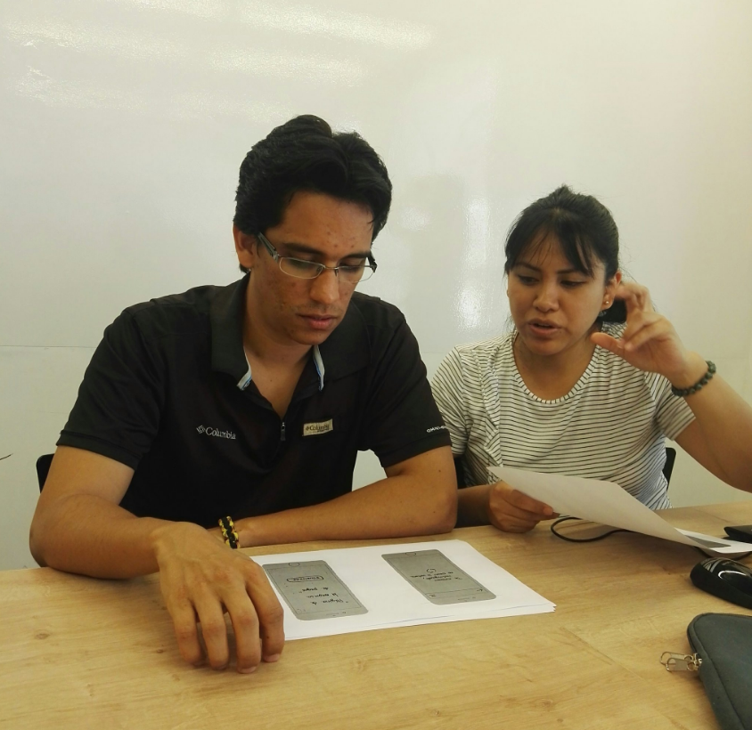
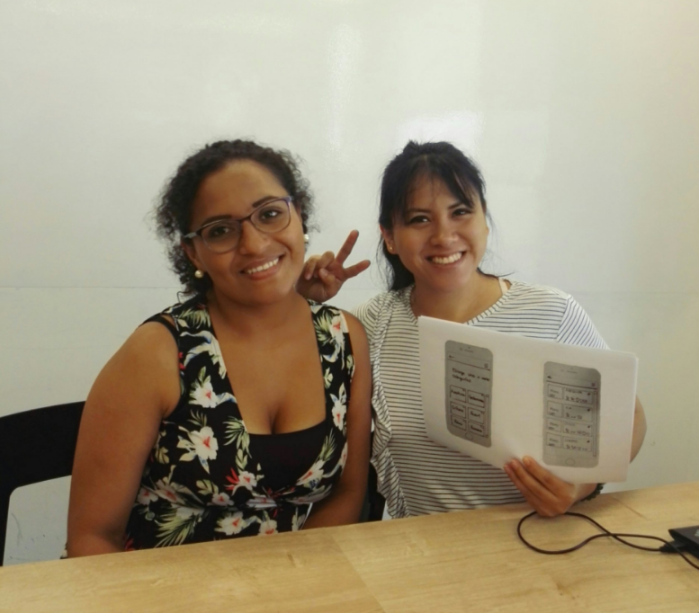

## UNIDAD 2

## CUSTOMER JOURNEY

Se realiza el primer viaje del usuario **antes** de conocer nuestro producto.

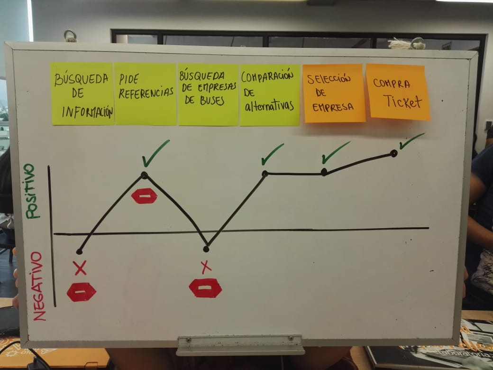

Se realiza el primer viaje del usuario **después** de conocer nuestro producto.

## STORYTELLING

Contamos la historia de nuestro user person, asi creamos un sentido de historia e identificamos como se soluciona el problema.

*Hola soy Tabatha, tengo 28 años y me encanta ahorrar para poder viajar. Conozco muchos lugares, sin embargo se que aun me falta conocer muchas ciudades de mi hermoso Perú.*

*Al momento de plantearme una nueva aventura, antes de elegir un sitio siempre me pregunto **¿Cómo llego hasta ahí?**
Un problema que siempre he tenido a sido encontrar información clara y actualizada.
Siempre tengo que llamar o preguntar varias a amigos por referencias de empresas o pasajes antes de comprar algún pasaje o hacer alguna reserva.*

*Hace poco una amiga me recomendó una aplicación que me solucionaría la vida, tenía pocas esperanzas pero decidí probarla.*

*Encontrar **Traveleando**, me soluciono la vida. - risas -*

*Puedo encontrar pasajes al destino que quiero.Y elegir la empresa que mas me convenga, las valoraciones de otros usuarios me ayudan mucho para poder elegir y confiar en que empresa escoger.*

*Ahora escoger mi destino y armar mi ruta es mucho mas fácil. Definitivamente recomendaría esta web.*

## USER FLOW

Se realiza el user flow de los portotipos de pantalla elaborados.

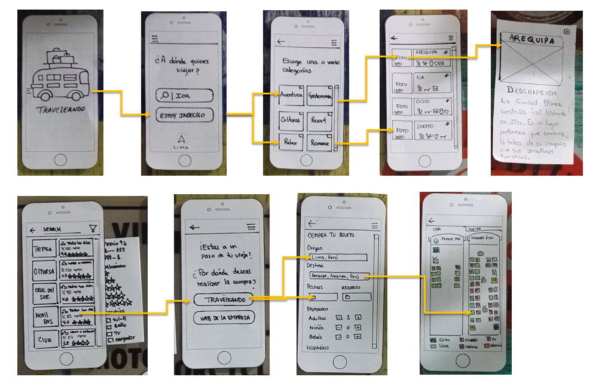
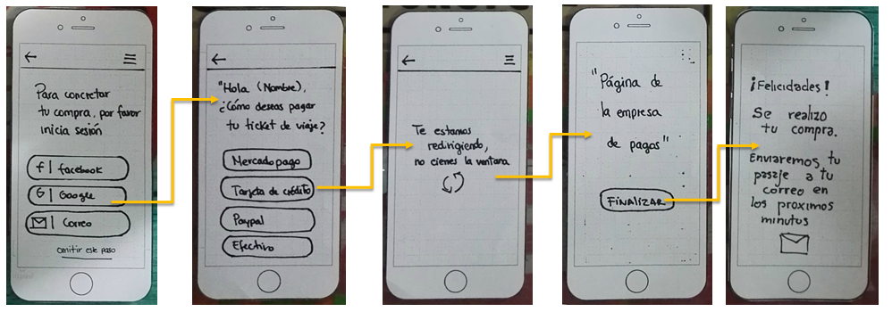

https://projects.invisionapp.com/share/FDFTSDVS9M7#/screens/279054683

## PROTOTIPOS INTERACTIVOS

Aquí podemos aprecia el prototipo desarrollado:

https://marvelapp.com/4f49e39

### **Integrantes**

>##### Esthefany Humpiri Vargas
>##### Flora María Huerta
>##### Lourdes lissete Loayza mesias
>##### Mayte Infante Vivas
>##### Paola Silvana Huaman Luyo
>##### Stephanie Wong Vega
